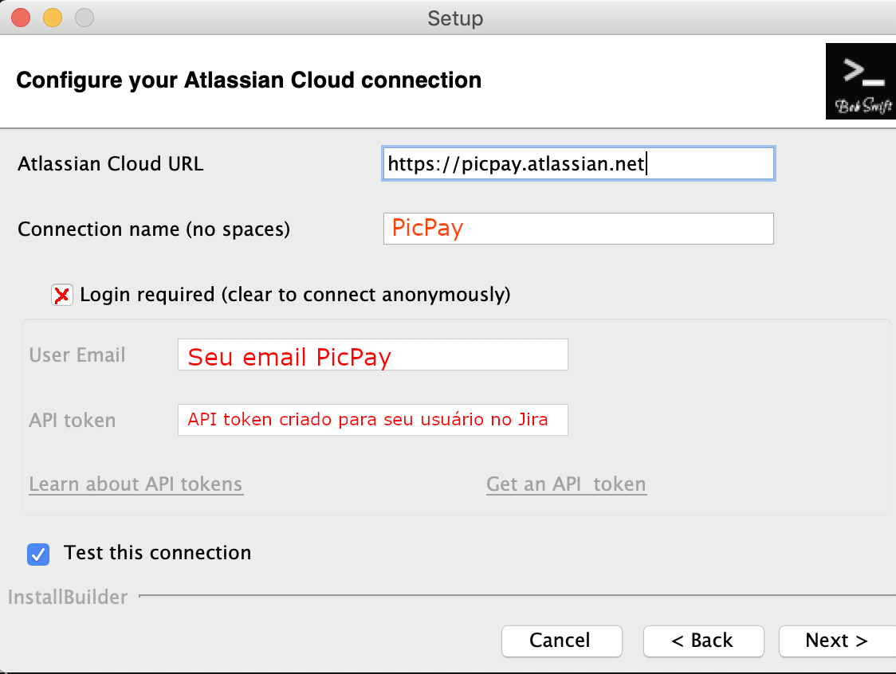

### JIRA TASK MANAGER


Realiza o controle da task do Jira criando uma issue e um pull request de forma automática.
O script identifica seu usuário Jira com base no valor da propriedade 'user.name' do seu '~/.gitconfig'.
Caso não encontre seu usuário Jira, você pode definir manualmente com os comandos abaixo:

```bash
> git config --global user.jira-id "<SEU ID NO JIRA>"
> git config --global user.jira-name "<SEU NOME NO JIRA>"
> git config --global user.jira-email "<SEU EMAIL NO JIRA>"
```

#### Cenário de Utilização

##### 1) O desenvolvedor deseja inciar o desenvolvimento da tarefa `PCR-999` do Jira:

```bash
> jira-task-manager --mode=create --task=PCR-999
> jira-task-manager -m=create -t=PCR-999
> gjt -t=PCR-999 (se já tiver criado o alias)
```

O script vai vincular a tarefa ao usuário e passar seu _status_ para `Em Andamento`,
em seguida, vai criar uma `issue` no Github e fazer um vínculo com a tarefa de origem no Jira.

##### 2) O desenvolvedor deseja concluir o desenvolvimento da tarefa `PCR-999` do Jira:

```bash
> jira-task-manager --mode=close --task=PCR-999
> jira-task-manager -m=close -t=PCR-999
> jira-task-manager -m=close (se não informar a task, será usado o nome da branch)
> cjt -t=PCR-999 (se já tiver criado o alias)
> cjt            (se já tiver criado o alias)
```

O script vai passar a tarefa para o _status_ `Review`,
em seguida, vai criar um `pull request` no Github e fazer um vínculo com a issue
de modo que ao concluir o `pull request`, a _issue_ vinculada seja automaticamente fechada.

OBS: Caso não seja informado a task a ser fechada, o script utiliza o nome da branch corrente para inferir o nome da task.


#### UTILIZAÇÃO

```bash
> jira-task-manager -m=[create|close] -t=<task-code> -r=<reposiory_name> -nb -nc -nd -fu -fr -wp -h
```

##### ARGUMENTOS

	-m  ou --mode           Iniciar ou concluir o desenvolvimento de uma task. Valores: [create|close]. (obrigatório)
	-t  ou --task           O código da task a ser utilizada. (obrigatório para iniciar uma task, opcional ao concluir)
	-r  ou --repo           O repositório do GitHub a ser utilizado. (default: PicPay)
	-nb ou --no-body        Criar a PR sem usar o parâmetro 'body', forçando uso do template pull-request-template.md. (default: false)
	-nc ou --no-confirm     Permite não pedir confirmação do usuário para iniciar o processo. (default: confirm)
	-nd ou --no-draft       Indica para criar a PR sem passar pelo modo 'draft'. (default: draft pr mode)
	-fu ou --force-update   Força a recuperação dos dados da task mesmo existindo no cache. (default: use cache)
	-fr ou --force-reassign Força a reassociação de uma task já vinculada a um outro usuário. (default: no reassign)
	-wp ou --with-pause     Uma pausa antes execução de cada comando. (default: no pause)
	-h  ou --help           Exibe esta ajuda.


#### PRÉ-REQUISITOS

1. ##### Configure uma chave de API para sua conta do Jira:
	https://id.atlassian.com/manage-profile/security/api-tokens
	OBS: anote o _token_ gerado para colocar na configuração do cli do Jira

1. ##### Baixe e instale a última versão do cliente do Jira: (atualmente ACLI-9.4.0-installer.dmg)

	https://bobswift.atlassian.net/wiki/spaces/info/pages/16285777/Downloads

   Na configuração do _cli_ do Jira informe o caminho que deseja instalar o utilitário.
   Sugiro colocar na pasta _home_ do seu usuário no caminho: `~/tools/atlassian-cli`.
   Depois informe os valores abaixo na caixa de diálogo `setup`:
	  - Atlassian Cloud URL: https://picpay.atlassian.net
	  - User Email: Seu email PicPay utlizado no Jira
	  - API token: Token gerado no passo anterior
	  - Connection name (no spaces): PicPay
	<br/>
  Vide a figura abaixo como deve ficar:
	

1. ##### Baixe e instale a última versão do cliente do Github:
	https://cli.github.com/

	Ou instale com o uso do _Home Brew_:
	```bash
	> brew install gh
	```

	Depois de ter instalado configure sua conta do GitHub com o comando:
	```bash
	> gh auth login
	```

	Ou, se já tiver instalado, atualize-o para a última versão com o comando:
	```bash
	> brew upgrade gh
	```


1. ##### Certifique-se que possui o utilitário de linha de comando _pbcopy_ (Default no macos):
	https://www.macobserver.com/tips/quick-tip/use-clipboard-in-terminal-without-mouse/

#### DICAS

__OBS__:
Depois de instalado o client do github confira se foi criado o arquivo `~/.config/gh/hosts.yml`
O arquivo deve ter no mínimo o seguinte conteúdo:

	github.com:
	  user: seu-user-no-github

Mais informação sobre como configurar o seu cliente do github:
https://docs.github.com/pt/free-pro-team@latest/github/authenticating-to-github/creating-a-personal-access-token

Coloque no _path_ a pasta contendo o script:
```bash
> export PATH="$HOME/tools/shell-scripts/:$PATH"
```

Coloque no _path_ a pasta contendo o local de instalação do client do Jira:
```bash
> export PATH="$HOME/tools/atlassian-cli/:$PATH"
```

Crie um alias para cada modo de execução do script:
```bash
> alias gjt="jira-task-manager -m=create" ## alias for: get-jira-task
> alias cjt="jira-task-manager -m=close"  ## alias for: close-jira-task
```

__OBS__:
Para tornar persistente e definivo as configurações da dica acima:
- _zshell_: coloque no seu arquivo `~/.zshrc`
- _bash_: coloque no seu arquivo `~/.bashrc`
